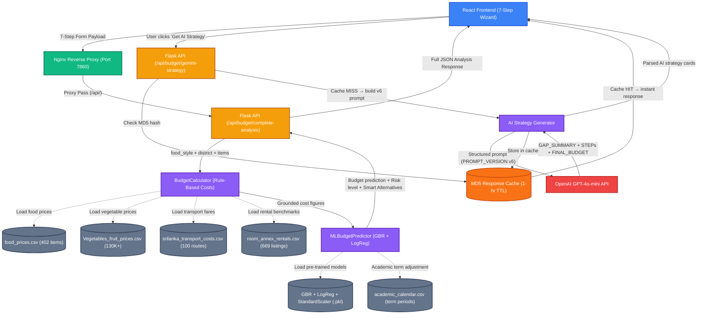

# Uni-Finder: AI-Powered Student Budget Optimizer — System Analysis

This document provides a comprehensive, deep-dive analysis of the AI-Powered Student Budget Optimizer component within the Uni-Finder platform. It details the backend architecture, implementation strategies, data flow, core mechanisms, and Software Engineering (SE) principles used to build a robust, AI-driven budget optimization engine for Sri Lankan university students.

---

## 1. System Overview

The Student Budget Optimizer is a microservice built with **Flask** in Python (`budget_optimizer_service/`). Its primary responsibility is to help Sri Lankan university students estimate realistic monthly living expenses, assess their financial risk, and receive personalised AI-generated budget optimization strategies. It does this by combining rule-based cost calculation (grounded in Sri Lankan market data), machine learning-based budget prediction, risk classification, and GPT-4o-mini-powered action-plan generation.

### 1.1 Target Audiences
- **Students living away from home**: Estimates actual accommodation, food, and transport costs for their district and lifestyle.
- **Students with diverse funding sources**: Handles parental support, part-time jobs, scholarships, and student loans with separate logic chains.
- **State university vs. private campus students**: Differentiates eligibility for benefits like the CTB student concession pass, which is only available to UGC-recognized state university students.

---

## 2. Backend Architecture & Components

The system follows a clean, layered architecture separating concerns into routing, rule-based calculation, ML prediction, and AI strategy generation.

### 2.1 The API Layer (`app.py`)
Defines RESTful endpoints using Flask. All routes are prefixed under `/api/budget/`:
- `/api/budget/calculate-food` — Rule-based monthly food budget calculation.
- `/api/budget/calculate-transport` — Rule-based monthly transport budget calculation.
- `/api/budget/predict` — ML-based budget prediction + risk classification.
- `/api/budget/complete-analysis` — **Main endpoint**: Combines all stages and returns the full analysis object.
- `/api/budget/gemini-strategy` — OpenAI GPT-4o-mini powered step-by-step budget strategy generation.
- `/api/model/performance` — Returns model accuracy metrics, dataset sizes, and model load status.
- `/api/data/districts`, `/api/data/universities`, `/api/data/food-prices`, `/api/data/transport-costs`, `/api/data/rental-prices` — Reference data endpoints used by the React frontend.

### 2.2 The Rule-Based Calculator (`budget_calculator.py`)
Calculates realistic food and transport budgets from Sri Lankan market data **before** any ML is involved. This grounds the ML feature vector in real figures rather than raw user estimates.

**Food calculation strategies (5 modes):**
- `Home Cooked` → `_calculate_grocery_budget()`: Prices per selected grocery item (rice, dhal, vegetables, protein, oil, spices) with district multipliers.
- `Food Delivery` → `_calculate_delivery_budget()`: Per-meal delivery costs (rice packet LKR 400 → biriyani LKR 650) with delivery fee addition.
- `Mixed` → `_calculate_mixed_budget()`: Weighted blend of grocery portion + outside meal portion based on `cooking_percentage` input.
- `Mostly Canteen/Restaurants` → `_calculate_restaurant_budget()`: Daily per-meal canteen costs, district-adjusted.
- `Full Meal Plan` → `_calculate_meal_plan_budget()`: Hostel/boarding fee passthrough.

**Transport calculation models (10 modes):**  
Real-world Sri Lanka 2024–2025 fare structures are hardcoded as domain knowledge:

| Mode | Formula |
|---|---|
| Bus (CTB/private) | min LKR 60 + LKR 10/km |
| Train (2nd class) | min LKR 30 + LKR 6/km |
| Tuk-Tuk | min LKR 130 + LKR 65/km |
| Ride-share (PickMe/Uber) | min LKR 200 + LKR 55/km |
| Personal Vehicle (motorbike) | LKR 23/km + LKR 2,500/month base |
| University Transport pass | LKR 2,500–5,000/month |
| Bicycle | LKR 500/month maintenance |
| Walking | Free if ≤ 2 km |
| Mixed | 65% Bus + 35% Tuk-Tuk weighted |

The calculator also models:
- **Miscellaneous emergency trips**: ~4 emergency tuk-tuk trips/month (LKR 130 per short ride) + LKR 600 for weekend city use — for public transport users.
- **Home visit costs**: Separate route cost (`distance_home_uni` × `home_transport` method × `visits_per_month`). Visits per month mapped from frequency labels (Daily → 0, Weekly → 4.33, Monthly → 1, Once per semester → 0.25).
- **Work commute** (optional): Fully independent third route for part-time workers, parameterized by `distance_work`, `work_transport_method`, and `work_days_per_week`.
- **Floor**: Minimum total of LKR 1,500/month to prevent unrealistically low outputs.

### 2.3 The ML Predictor (`ml_budget_predictor.py`)
Loads pre-trained `.pkl` model files at startup and provides budget prediction, risk classification, and strategy generation.

**Loaded files at startup:**
- `budget_optimizer_gbr_model_final_optimized.pkl` — Gradient Boosting Regressor
- `risk_classifier_model_final.pkl` — Logistic Regression risk classifier
- `feature_preprocessor_final.pkl` — StandardScaler fitted during training
- `food_prices.csv`, `room_annex_rentals.csv`, `srilanka_transport_costs.csv` — for computing live feature values
- `academic_calendar.csv` — for dynamic budget adjustment by university term period

**Model loading pattern** — Each model is loaded inside a `try/except` block using `joblib.load()`. If a `.pkl` file is missing, the model attribute is set to `None` and the system falls back to rule-based estimation (`_fallback_prediction()`), so the service always responds even without models.

### 2.4 The AI Strategy Layer (`app.py → /api/budget/gemini-strategy`)
On explicit user button-click, the complete financial profile is sent to OpenAI GPT-4o-mini with a structured prompt that enforces:
- Sri Lankan cultural and ethical constraints (see Section 4.3)
- Strict numeric output format (GAP_SUMMARY → STEP N → FINAL_BUDGET → QUICK_WIN → MOTIVATION)
- Line-item savings that sum to the exact gap between current and target expenses
- Dynamic savings buffer: 10% of income (minimum LKR 2,000)

---

## 3. Data Flow and Processing Mechanisms

Let's trace the data flow for the **Complete Budget Analysis** (`/api/budget/complete-analysis`) — the main endpoint called by the React form on Submit.

### Step 1: Request Reception
The React form submits a JSON payload containing all 7 steps of the form. Key fields include:
```json
{
  "food_type": "Mixed",
  "cooking_percentage": 60,
  "diet_type": "Non-Vegetarian",
  "meals_per_day": "3 meals",
  "district": "Colombo",
  "transport_method": "Bus",
  "distance_uni_accommodation": 5,
  "distance_home_uni": 80,
  "home_visit_frequency": "Monthly",
  "has_work_commute": false,
  "monthly_income": 30000,
  "home_money": 5000,
  "university": "University of Moratuwa",
  "year_of_study": "Second Year",
  "accommodation_type": "Rented Room",
  "rent": 10000,
  "funding_source": "Parental/Family Support",
  "affordability_accommodation": 3,
  "affordability_food": 3,
  "affordability_transport": 3,
  "affordability_materials": 3,
  "affordability_social": 3,
  "financial_comfort": 3
}
```

### Step 2: Rule-Based Food Calculation (`BudgetCalculator.calculate_food_budget()`)
The food payload is extracted and routed to the appropriate food-type handler. District multipliers are applied (Colombo = 1.2, Kandy = 1.0, Galle = 0.95). The result includes `monthly_total`, `daily_cost`, and a category breakdown.

### Step 3: Rule-Based Transport Calculation (`BudgetCalculator.calculate_transport_budget()`)
Daily commute, miscellaneous trips, home visits, and optional work commute are all calculated using the fare formulas. The total is the sum of all four segments. A minimum floor of LKR 1,500 applies.

### Step 4: Income Consolidation
```python
monthly_income_total = base_income + home_money  # e.g. 30,000 + 5,000 = 35,000
```
The `home_money` field ("Money from Home") is added to base income before passing to ML, ensuring the prediction reflects the student's real available resources.

### Step 5: ML Budget Prediction (`MLBudgetPredictor.predict_budget()`)
The student data dictionary (now containing calculated food/transport figures) is passed to `preprocess_input()`, which builds the **16-feature vector** (see Section 4.1). The GBR model returns a `predicted_optimal_budget`. Dynamic calendar adjustment is applied: if the current month falls in an Exam or Study Leave period (determined via `academic_calendar.csv`), the budget is inflated by 15%.

### Step 6: Risk Classification (`MLBudgetPredictor.predict_risk()`)
The same 16-feature vector is passed to the Logistic Regression classifier. It returns:
- `risk_level`: `"High Risk"` or `"Low Risk"`
- `risk_score`: floating-point probability (0.0–1.0)
- `risk_probability`: percentage display value (e.g., 72.3%)

### Step 7: Optimal Strategy Generation (`MLBudgetPredictor.generate_optimal_budget_strategy()`)
The ML-predicted optimal budget is compared against the student's current total expenses. The system enforces a correction rule:
- If `ml_optimal ≥ current_total` (model over-estimates): target = `current_total × 0.87` (13% reduction)
- If `ml_optimal < current_total`: target = `max(ml_optimal, current_total × 0.70)` (cap at 30% reduction max)
- Hard floor: target must be ≥ 50% of income

Category-level alternatives are then generated using rule-based logic for each expense category (Food, Transport, Entertainment, Income Enhancement) with state university vs. private campus branching.

### Step 8: Response Assembly
The six outputs are combined into a single JSON response:
- `calculated_budgets` (food + transport objects)
- `expense_breakdown` (all 9 line items + total)
- `financial_summary` (income, expenses, savings, savings_rate)
- `ml_prediction` (GBR output + confidence)
- `risk_assessment` (level, score, recommendations)
- `optimal_strategy` (Smart Budget Alternatives, targets, max savings potential)

---

## 4. Special Features & Noteworthy Implementations

### 4.1 The 16-Feature Vector (`preprocess_input()`)
The model was trained on exactly 16 features, divided into four groups:

| Group | Features |
|---|---|
| **Financial** | `Income`, `Transport` |
| **Lifestyle** | `Work_Hours`, `Comfort` (1–5 scale) |
| **Affordability perceptions** | `Aff_Accommodation`, `Aff_Food`, `Aff_Materials`, `Aff_Transport`, `Aff_Social` (all 1–5) |
| **Funding flags** | `Has_Parental`, `Has_Job`, `Has_Scholarship`, `Has_Loan` (binary 0/1) |
| **Real-world pricing** | `Food_Cost_Multiplier`, `Avg_District_Rent`, `Avg_Transport_Cost` |

The 3 real-world pricing features are loaded from CSV at startup and used as live-valued features at inference time:
- `Food_Cost_Multiplier`: `mean(food_prices.csv price column) / 200` — normalized average food price index.
- `Avg_District_Rent`: `median(cleaned price column from room_annex_rentals.csv)`.
- `Avg_Transport_Cost`: `median(cost column from srilanka_transport_costs.csv)`.

These three features anchor predictions to actual Sri Lankan market conditions rather than purely survey self-reports, making them the most impactful for district-level accuracy.

**Funding source parsing** — The `funding_source` field is a multi-select string from the form:
```python
has_parental = 1 if 'Parental' in funding_source or 'Family' in funding_source else 0
has_job      = 1 if 'Part-time' in funding_source or 'Job' in funding_source else 0
has_scholarship = 1 if 'Scholarship' in funding_source or 'Grant' in funding_source else 0
has_loan     = 1 if 'Loan' in funding_source else 0
```
Each funding type has a measurably different effect on spending behaviour, so they are encoded as separate binary flags rather than a single categorical variable.

**StandardScaler application** — After assembling the 16-feature `DataFrame`, `feature_preprocessor.transform(df)` is applied using the same scaler fitted during training. This ensures inference normalisation is identical to training normalisation.

### 4.2 State University vs. Private Campus Detection (`is_state_uni`)
The strategy generator detects university type using a keyword tuple:
```python
STATE_UNI_KEYWORDS = (
    'university of colombo', 'university of peradeniya', 'university of moratuwa',
    'university of kelaniya', 'university of sri jayewardenepura',
    'university of jaffna', 'university of ruhuna', 'eastern university',
    'south eastern university', 'wayamba university', 'rajarata university',
    'sabaragamuwa university', 'uva wellassa', 'visual and performing arts',
    'open university of sri lanka', 'open university', 'kotelawala', 'kdu',
    'general sir john',
)
_uni_lower = student_data.get('university', '').lower()
is_state_uni = any(k in _uni_lower for k in STATE_UNI_KEYWORDS)
```

**Why this matters:**  
The CTB student concession pass (50% daily fare reduction) is a legal benefit exclusively available to UGC-recognized state university students. Applying the save advice to private campus students (SLIIT, NSBM, APIIT, CINEC, etc.) would be factually incorrect and potentially misleading. The `is_state_uni` flag gates this advice in both the rule-based strategy in `ml_budget_predictor.py` and the OpenAI prompt's ethical guidelines in `app.py`.

### 4.3 Ethical Guardrails (Prompt Engineering & Rule-Based)
The system enforces Sri Lankan cultural and social constraints at two levels:

**Level 1 — Rule-based (`ml_budget_predictor.py`):**
- Transport > LKR 3,500 + state university → action steps include CTB concession pass, registrar letter workflow.
- Transport > LKR 3,500 + private campus → action steps exclude CTB; suggest off-peak travel, campus shuttle, train route check.
- `has_work_commute = True` → Income Enhancement card says "Primary income + part-time job" and suggests skill upgrades/bursaries; NOT "get a part-time job".
- `has_work_commute = False` → Income Enhancement card suggests tutoring, on-campus roles, micro-freelancing.

**Level 2 — OpenAI prompt ETHICAL GUIDELINES block:**
```
Accommodation — FORBIDDEN: Do NOT suggest negotiating rent with landlords
(students have no bargaining power in Sri Lanka).
Transport — FORBIDDEN: Do NOT suggest limiting or reducing home visits —
visiting family is culturally important and non-negotiable.
Food — FORBIDDEN: Do NOT suggest skipping meals or reducing daily meal count.
Income — PART-TIME JOB RULE: If student already has a part-time job, 
do NOT suggest getting one — suggest bursaries/tutoring/skill upgrades instead.
CTB CONCESSION RULE: Only mention CTB pass for state university students.
```

**PROMPT_VERSION** is set to `"v6-state-vs-private-uni-ctb-parttime-aware"`. Incrementing this string busts the 1-hour in-memory MD5 cache, ensuring stale responses are not served after a prompt change.

### 4.4 Dynamic Budget Adjustment (Academic Calendar)
The `academic_calendar.csv` is parsed to detect if the current calendar month falls within an exam or study leave period. If so, the GBR prediction is inflated by 15%:
```python
if 'Exam' in period_type or 'Study' in period_type:
    adjusted_budget = base_budget * 1.15
```
This is a deliberate domain-knowledge override — students genuinely spend more during exam periods (printing, study materials, late-night food, extra transport for library visits).

### 4.5 Fallback Mechanisms
The system is built for resilience at three levels:

| Scenario | Fallback |
|---|---|
| GBR `.pkl` file missing | `_fallback_prediction()` — rule-based proportional split (food 35%, accommodation 30%, transport 15%, materials 10%, entertainment 5%, other 5% of income) |
| Risk classifier missing | Returns `{ "risk_level": "Unknown", "risk_score": 0.5 }` |
| OpenAI API rate-limit (HTTP 429) | Exponential backoff retry (up to 2 retries). If all retries fail, returns a structured error JSON with `"error": "OpenAI rate limit exceeded"` |
| OpenAI auth failure | Immediate return — no retry. Returns `"OpenAI authentication failed"` |
| OpenAI cache hit | Serves MD5-keyed cached response, skipping API entirely |

---

## 5. Software Engineering (SE) Principles Applied

1. **Separation of Concerns (SoC)**: The Flask route handlers (`app.py`) do not contain business logic. Calculation logic lives in `budget_calculator.py`. ML inference and strategy generation lives in `ml_budget_predictor.py`. Each class has a single responsibility.
2. **Strategy Pattern (food calculation)**: The `calculate_food_budget()` dispatcher delegates to one of five private strategy methods based on `food_type`. Adding a new food mode requires only a new private method and one `elif` branch — no changes to the public interface.
3. **Fail-Gracefully / Resilience**: Every external dependency (`.pkl` files, OpenAI API, CSV data) has a try/except guard and a deterministic fallback. The service never returns an unhandled 500 crash for normal input.
4. **In-Memory Caching**: 1-hour in-memory cache for OpenAI responses using MD5 key derived from `{income, expenses, savings_rate, risk_level, prompt_version}`. Prevents redundant API calls for identical financial profiles.
5. **Environment Variable Isolation**: `OPENAI_API_KEY` and `CORS_ORIGINS` are loaded from `.env` via `python-dotenv`. No secrets appear in source code. CORS is dynamically configured from the environment — `"*"` for dev, explicit origins list for production.
6. **Input-Driven vs. Hardcoded**: District multipliers, transport fare formulas, and food cost baselines are explicit named constants in the code, not magic numbers buried in expressions. This makes Sri Lankan market data changes (e.g. fuel price revision) a single-line update.

**CORS Configuration Pattern:**
```python
def _build_cors_origins():
    cors_env = os.getenv("CORS_ORIGINS", "").strip()
    if cors_env == "*":
        return "*"
    if cors_env:
        return [origin.strip() for origin in cors_env.split(",") if origin.strip()]
    return ["http://localhost:3000", "http://127.0.0.1:3000", ...]
```
This pattern avoids wildcarding CORS in production by default, while still allowing developer flexibility.

---

## 6. Frontend Integration

The React frontend (`frontend/src/pages/BudgetOptimizerNew.js`) communicates with the Flask service via REST API calls.

- **State Management**: A 7-step multi-form wizard collects data step-by-step, with conditional field rendering (e.g., if `has_work_commute = true`, a work-commute sub-form appears).
- **Step Indicator**: A visual progress stepper highlights the current step and validates form fields before allowing navigation to the next step.
- **Results Dashboard**: On submission, the frontend calls `/api/budget/complete-analysis`. The JSON response powers:
  - A financial summary card (income / expenses / savings / savings rate)
  - A risk assessment badge (High Risk / Low Risk with probability %)
  - An expense breakdown with category bars
  - A Smart Budget Alternatives section (showing `current_choice → optimal_choice` cards per category with action steps)
  - A "Budget Transformation" animation showing the gap between current and optimised budgets
- **AI Strategy Section**: On a separate button click, the frontend calls `/api/budget/gemini-strategy` passing the same analysis data. The response is streamed and rendered as a ChatGPT-style typed text output.
- **Print Report**: A dedicated print stylesheet renders the complete analysis as a formatted printable report.

---

## 7. Low-Level Data Structures & Schemas

### 7.1 Complete Analysis Response Schema
The `/api/budget/complete-analysis` endpoint returns:
```json
{
  "success": true,
  "timestamp": "2026-05-02T...",
  "calculated_budgets": {
    "food": {
      "monthly_total": 18450,
      "food_type": "Mixed",
      "breakdown": { "groceries": 9900, "outside_meals": 8550 },
      "daily_cost": 615
    },
    "transport": {
      "monthly_total": 5620,
      "breakdown": {
        "daily_commute": 2598,
        "misc_trips": 1720,
        "home_visits": 1200,
        "work_commute": 0
      },
      "transport_method": "CTB / Private Bus",
      "one_way_trip_cost": 110,
      "commute_days_per_month": 22
    }
  },
  "expense_breakdown": {
    "rent": 10000, "food": 18450, "transport": 5620,
    "internet": 1500, "study_materials": 2000,
    "entertainment": 2000, "utilities": 1000,
    "healthcare": 1000, "other": 500,
    "total_expenses": 42070
  },
  "financial_summary": {
    "monthly_income": 35000, "base_income": 30000, "home_money": 5000,
    "total_expenses": 42070, "monthly_savings": -7070, "savings_rate": -20.2
  },
  "ml_prediction": {
    "predicted_optimal_budget": 30405,
    "breakdown": { "food": 10641, "accommodation": 9121, ... },
    "confidence": 86.89,
    "model_used": "GBR_Optimized"
  },
  "risk_assessment": {
    "risk_level": "High Risk",
    "risk_score": 0.842,
    "risk_probability": 84.2,
    "recommendations": [...]
  },
  "optimal_strategy": {
    "strategy_name": "Personalized Optimal Budget Plan",
    "current_situation": { "total_expenses": 42070, "savings": -7070, "savings_rate": -20.2 },
    "optimal_target": { "target_expenses": 36601, "target_savings": 3399, "target_savings_rate": 9.7 },
    "optimal_alternatives": [
      {
        "category": "Food",
        "current_choice": "Mixed food – LKR 18,450/month",
        "optimal_choice": "Increase home cooking to 80%+ ...",
        "reasoning": "...",
        "estimated_savings": 3200,
        "action_steps": ["...", "..."],
        "priority": "High"
      }
    ],
    "maximum_savings_potential": 9120
  }
}
```

### 7.2 Training Dataset Schema (Student Budget Survey.csv)
The primary training dataset has 1,018 rows. Key columns used after engineering:

| Column | Type | Notes |
|---|---|---|
| `Income` | Numeric | Monthly income (LKR) |
| `Transport` | Numeric | Monthly transport cost |
| `Work_Hours` | Numeric | Hours of part-time work per week |
| `Comfort` | Numeric (1–5) | Self-reported financial comfort |
| `Affordability_*` (5 columns) | Numeric (1–5) | Per-category affordability rating |
| `Funding_Source` | Multi-select string | Parsed into 4 binary Has_* flags |
| `Total_Expenses` | Numeric | **Target variable** for GBR regression |
| `Financial_Risk` | Binary (0/1) | **Target variable** for Logistic Regression |

### 7.3 Auxiliary Dataset Schemas

**`food_prices.csv`** (402 items):
- `Item_Name`, `Category`, `District`, `Price (LKR)`, `Unit`

**`Vegetables_fruit_prices.csv`** (130,000+ records):
- District-level produce prices, used for food cost multiplier calibration

**`srilanka_transport_costs.csv`** (100 routes):
- `Source_District`, `Destination_District`, `Cost`, `Mode`, `Distance_km`

**`room_annex_rentals.csv`** (669 listings):
- `District`, `Rent`/`Monthly_Rent`/`Price` (cleaned via regex strip of "Rs", "LKR", "/month"), `Room_Type`

**`academic_calendar.csv`**:
- `Month` (1–12), `Period_Type` (Regular, Exam, Study Leave, Vacation)

---

## 8. Software Engineering & Robustness

### 8.1 Security & Authentication
- **CORS Policies**: Enforced via `flask-cors`. Origins are controlled by the `CORS_ORIGINS` environment variable; production deployments set explicit origins to prevent unauthorized cross-origin requests.
- **No API Keys on Client**: `OPENAI_API_KEY` is loaded server-side from `.env` and never exposed to the React frontend or browser network tab.
- **Input Passthrough Safety**: All numeric inputs from the frontend (distances, income, rent) are explicitly cast (`float()`, `int()`) before arithmetic. Non-numeric values caught by Python's type casting will trigger the `except Exception` block and return a clean HTTP 500 JSON with the error message — not a stack trace.

### 8.2 Rate Limiting & API Abuse Prevention
- **Retry logic with exponential backoff**: `call_openai_with_retry(max_retries=2)`. On rate limit (HTTP 429): waits `(2^attempt) + fractional_jitter` seconds before retrying, preventing thundering herd.
- **In-memory response cache (1-hour TTL)**: The MD5 cache key includes `prompt_version`. Students with the same income/expense profile within 1 hour share a cached response. This dramatically reduces OpenAI API calls for common student profiles.
- **Max tokens cap**: OpenAI call is capped at `max_tokens=1600` to prevent unexpectedly large responses from inflating costs.

### 8.3 Global Exception Handling & Logging
All Flask route handlers wrap their logic in a `try/except Exception as e` block and return:
```json
{ "success": false, "error": "string description of error" }
```
with HTTP 500. This prevents the React frontend from receiving an HTML error page, which would crash the JSON parser.

Console logging uses Python's `print()` with emoji prefixes for fast visual scanning:
- `✅` — successful operations
- `⚠️` — non-fatal warnings (missing CSV, API unavailable)
- `❌` — errors
- `📊` — analysis start markers
- `💾` — cache write

---

## 9. System Architecture & Deployment Strategy

### 9.1 Microservice Architecture
The budget optimizer runs as an independent Flask microservice on port `5002`. It communicates with the Node.js Express backend (port `5000`) only for data persistence (saving analysis results to MongoDB). All budget calculations, ML inference, and AI strategy generation run entirely within this service.

### 9.2 Supervisor & Nginx Orchestration (Hugging Face Deployment)
For the Hugging Face Docker Space deployment, the system uses **Supervisor** to run all 5 microservices inside a single container with Nginx as the reverse proxy on port `7860`:
- `budget` (Flask, port 5002, Priority 40)
- Nginx routes `/api/budget/` → `http://127.0.0.1:5002/api/budget/`

### 9.3 Docker Container
The budget service has its own `Dockerfile` based on `python:3.11-slim`. It copies the `data/` directory (CSV datasets and `.pkl` model files) and installs from `requirements.txt`:
```
flask, flask-cors, pandas, numpy, scikit-learn, openai, python-dotenv
```
ML model files (`.pkl`) are tracked via Git LFS to stay within standard git push limits.

### 9.4 CI/CD Pipeline (GitHub Actions)
Deployment is automated via `deploy-hf-spaces.yml`. Path filtering ensures the monolith rebuild only triggers when files inside `budget_optimizer_service/` actually change. GitHub Secrets inject `HF_TOKEN` for authenticated push to the Hugging Face Space.

---

## 10. Technical Justifications & Evaluation Methodology

### 10.1 Why Gradient Boosting Regressor?
The budget prediction problem involves predicting a continuous numeric value (optimal monthly budget) from a mix of numeric, ordinal, and binary features. Comparison during training:

| Model | Cross-validated R² | Notes |
|---|---|---|
| **Gradient Boosting Regressor** | **86.89%** | Best performance, handles non-linear patterns |
| Random Forest | ~83% | Good but lower R² on CV |
| Linear Regression | ~71% | Underfits — income-expense relationship is non-linear |

GBR builds trees sequentially, each correcting the residuals of the previous tree. This ensemble structure captures the non-linear interaction between, for example, funding source (Has_Scholarship) and affordability perception (Aff_Food), which linear models cannot model without manual feature crosses.

GBR also does not require feature scaling internally (unlike distance-based models), but StandardScaler is still applied for consistency because the feature preprocessor was fitted jointly on all 16 features during training.

### 10.2 Why Logistic Regression for Risk Classification?
The risk classification is a binary problem (High Risk / Low Risk). Logistic Regression was selected over more complex classifiers for two reasons:
1. **Interpretability**: The model outputs a calibrated probability (`predict_proba`) that can be shown directly to the student as "72.3% chance of financial stress" — meaningful and understandable.
2. **Sufficient accuracy**: 82.5% accuracy on the test set for a 2-class problem with 1,018 samples is solid. A deep neural network for this sample size would be severe over-engineering with high overfitting risk.

### 10.3 Why GPT-4o-mini (not Gemini, not GPT-4o)?
Similar reasoning applies to OpenAI model selection:

| Criterion | GPT-4o-mini | GPT-4o | Gemini 2.5 Flash |
|---|---|---|---|
| Cost per request | ~$0.0001 | ~$0.01 | Free tier (15 RPM) |
| Latency | < 2 seconds | ~3–5 seconds | ~1.5–3 seconds |
| Structured output quality | Excellent | Best | Good |
| Availability (paid tier) | Consistent | Consistent | Rate-limited on free |

The structured prompt format (GAP_SUMMARY → STEP N → FINAL_BUDGET → QUICK_WIN → MOTIVATION) requires exact field adherence. GPT-4o-mini reliably follows this format at a cost of fractions of a cent per request, making it the optimal choice for a free student utility.

### 10.4 Estimated Latency Breakdown (TTFB Analysis)
The complete analysis endpoint involves:

| Stage | Estimated time |
|---|---|
| Food calculation (CSV lookup + arithmetic) | ~5–20 ms |
| Transport calculation (pure arithmetic) | ~1–5 ms |
| ML preprocessing + GBR prediction | ~50–150 ms |
| Logistic Regression risk classification | ~5–20 ms |
| Strategy generation (rule-based alternatives) | ~10–50 ms |
| Response assembly + JSON serialisation | ~5 ms |
| **Total (without AI strategy)** | **~100–250 ms** |

The `/api/budget/gemini-strategy` (AI step-by-step strategy) adds the OpenAI API call:
- Network transit + GPT-4o-mini inference: ~800–2,000 ms
- **Total with AI strategy**: ~1–2.5 seconds

If the 1-hour cache is hit: response is returned in < 5 ms.

### 10.5 Model Training Methodology
Both models were trained from scratch in `budget_optimizer_service/notebooks/Student_Budget_ML_Training_ADVANCED.ipynb`:
- **Dataset split**: 80% training / 20% test, stratified by `Financial_Risk` label to maintain class balance in both splits.
- **Hyperparameter tuning**: `GridSearchCV` with 5-fold cross-validation exhaustively searched a parameter grid (n_estimators, max_depth, learning_rate for GBR; C, solver, penalty for Logistic Regression) and selected the best-performing configuration.
- **Feature scaling**: `StandardScaler` fitted on the 80% training set only. Applied to both train and test sets at inference — the fitted scaler is serialised to `feature_preprocessor_final.pkl` and loaded at runtime.
- **Evaluation metrics**:
  - GBR: R² = 86.89%, MAE ≈ LKR 1,200–1,800, MAPE < 10%
  - Logistic Regression: Accuracy = 82.5%, with full classification report (precision/recall/F1) per class

---

## 11. Optimal Strategy Generation Logic

### 11.1 Smart Budget Alternatives (Category-Level Rules)
The `generate_optimal_budget_strategy()` function compares each expense category against realistic Sri Lankan student benchmarks and generates alternatives for categories that exceed thresholds.

**Thresholds used:**

| Category | Trigger condition | Alternative generated |
|---|---|---|
| Food | > LKR 15,000/month | Increase home cooking, bulk buying, Sunday pola markets |
| Transport (Tuk-Tuk/Ride-share) | Any usage | Switch to bus; state uni gets CTB concession steps, private gets off-peak advice |
| Transport (Bus) | > LKR 3,500/month | State: CTB concession pass; Private: off-peak travel, campus shuttle, train check |
| Entertainment/Social | > LKR 3,000/month | Student ID discounts, free university events, batched social activities |
| Income Enhancement | All students | `has_work_commute` flag determines if "get a job" or "upgrade skills" advice is shown |

### 11.2 Optimal Target Calculation
```python
if ml_optimal >= current_total:
    # Model over-estimated; enforce 13% reduction
    optimal_budget = round(current_total * 0.87, 2)
else:
    # Model gives lower target; cap max reduction at 30%
    min_possible = current_total * 0.70
    optimal_budget = round(max(ml_optimal, min_possible), 2)

# Hard floor: can't live on < 50% of income
optimal_budget = max(optimal_budget, monthly_income * 0.50)
```

**Why this correction is necessary:**  
The GBR model was trained on survey self-reports. Students sometimes under-estimate their expenses when filling in surveys. If the model predicts a budget *higher* than what the student actually calculates (because their calculated food + transport is lower than the average survey responder's), setting "optimal = current + 5%" would be confusing. The correction ensures the "optimal" target always represents an improvement opportunity.

---

## 12. OpenAI Prompt Engineering & Output Parsing

### 12.1 Prompt Structure
The prompt is assembled dynamically from the student's financial data and injected into the following structured template:

```
─── STUDENT ────────────────────────────────────────────────
─── INCOME vs EXPENSE CONSTRAINT ───────────────────────────
─── CURRENT EXPENSE BREAKDOWN ──────────────────────────────
─── AI-SUGGESTED OPTIMISED BUDGET ──────────────────────────
─── AI-IDENTIFIED ALTERNATIVES ─────────────────────────────
─── OUTPUT FORMAT ───────────────────────────────────────────
─── ETHICAL & REALISTIC GUIDELINES (MUST FOLLOW) ────────────
─── STRICT RULES ────────────────────────────────────────────
```

**Key constraint injection:**
```
Safe-Spend Ceiling     : LKR {income_ceiling}  ← expenses MUST be ≤ this
Minimum Monthly Saving : LKR {MIN_SAVINGS_BUFFER}  ← 10% of this student's income
```
`MIN_SAVINGS_BUFFER = max(round(income * 0.10), 2000)` — dynamic per student, not a fixed number.

### 12.2 Output Format Enforcement
The model is instructed to output exactly:
```
GAP_SUMMARY: ...
STEP 1: title
CATEGORY: ...
SAVE: LKR X
HOW: ...
TIMEFRAME: ...
LINKS: [markdown link] | [markdown link]
...
FINAL_BUDGET: Food: LKR X | Transport: LKR X | ... | SAVINGS: LKR X | FITS WITHIN INCOME: YES
QUICK_WIN: ...
MOTIVATION: ...
```

The React frontend parses this format line-by-line to render each `STEP`, `SAVE`, `HOW`, and `LINKS` as a distinct styled card. The `FINAL_BUDGET` line is parsed into the Budget Transformation animation that visually shows the before/after comparison.

### 12.3 Hallucination Prevention
- **Negative prompting**: `Do NOT suggest negotiating rent with landlords`, `Do NOT suggest skipping meals`, `Do NOT suggest limiting home visits`.
- **Domain grounding**: Every `HOW` field is required to reference Sri Lanka-specific context (CTB buses, Keells/Cargills, student ID, BOC/NSB bank). This forces the model to use real local entities rather than generic financial platitudes.
- **Numeric bounds enforcement**: `TOTAL in FINAL_BUDGET must be ≤ LKR {income_ceiling}` and `SAVINGS must be ≥ LKR {min_saving}` are stated as explicit non-negotiable constraints in the STRICT RULES block.
- **No temperature=0**: The model runs at `temperature=0.7` because completely deterministic output at temperature 0 tends to produce repetitive, robotic advice. The structured format + ethical rules provide sufficient constraint without sacrificing natural language quality.

---

## 13. System Architecture Flowchart (Data Flow)

The following Mermaid diagram visualizes the complete end-to-end data flow of a budget analysis request, from the React UI through the rule-based calculator and ML predictor to the OpenAI API and back.



---

## QUICK-REFERENCE FACTS

| Fact | Value |
|---|---|
| Primary training dataset | 1,018 Sri Lankan student survey responses |
| Total datasets | 6 (survey + food + vegetables/fruit + transport + accommodation + academic calendar) |
| Food price items | 402 items (`food_prices.csv`) |
| Vegetable price records | 130,000+ district-level records |
| Transport routes | 100 routes (`srilanka_transport_costs.csv`) |
| Accommodation listings | 669 listings (`room_annex_rentals.csv`) |
| ML features | 16 features |
| Budget predictor algorithm | Gradient Boosting Regressor |
| Risk classifier algorithm | Logistic Regression |
| Feature scaler | StandardScaler |
| Budget prediction R² | 86.89% |
| Risk classification accuracy | 82.5% |
| Train/test split | 80/20 stratified |
| Cross-validation | 5-fold GridSearchCV |
| AI strategy model | GPT-4o-mini (OpenAI) |
| AI cache TTL | 1 hour (MD5 key) |
| Flask service port | 5002 |
| Form steps | 7-step multi-form wizard |
| Transport modes modelled | 10 (Bus, Train, Tuk-Tuk, Ride-share, Personal Vehicle, University Transport, Bicycle, Walking, Mixed) |
| State university keywords | 18 keywords in `STATE_UNI_KEYWORDS` tuple |
| PROMPT_VERSION | v6-state-vs-private-uni-ctb-parttime-aware |
